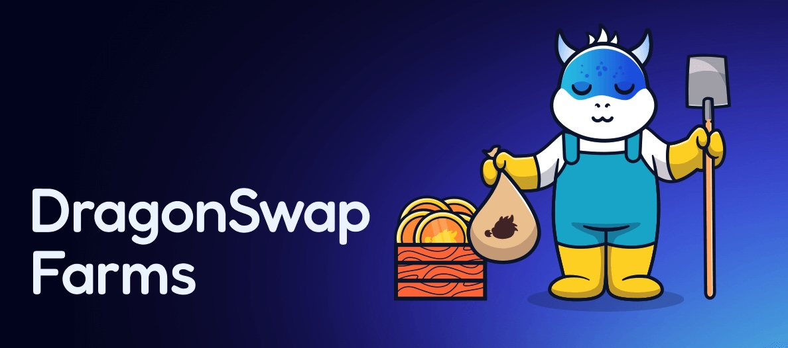

# Dragonswap Farming Contracts 

## Setup

### Git config
`$ git config url."https://".insteadOf git://`

### Dependencies
- `$ nvm use`
- `$ yarn`

### Environment
 - Fill in the environment values as described with .env.example template inside the .env file (comand below)
---
## Usage
### Compile code
`$ yarn compile`

### Run tests
`$ yarn test`

### Run coverage
`$ yarn coverage`

### Run lint
`$ yarn lint`

### Format code
`$ yarn format`

### Compute bytecode size of each contract
`$ yarn size`

---
## Setup local node
### Setup hardhat node
`$ yarn node`

### Setup node forked from Sei Mainnet
`$ yarn node-mainnet`

### Setup node forked from Sei Testnet
`$ yarn node-testnet`

## CI
### Update abis manually
`$ node scripts/updateAbis.js`

---
## License
MIT
